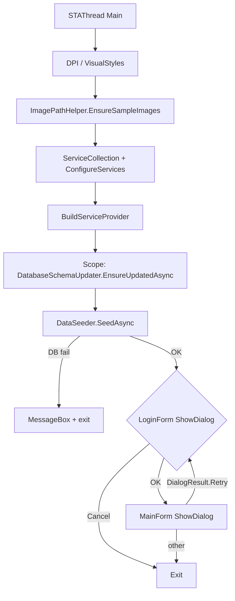
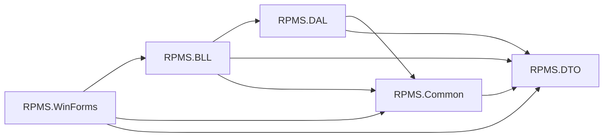

# 00 — Project Overview

**Section mapping:** §1 Overview, §6 Program flow (startup)

---

## 1. What RPMS is

RPMS (Rental Property Management System) is a **desktop WinForms** application for managing rental housing: houses/rooms, listing posts, contracts, invoices (meter-based), appointments, favorites, maintenance, manager assignments, chat, calendar, reports, and notifications.

There is **no ASP.NET / Web API project** in `RPMS.sln`. All user interaction is through WinForms; business rules live in `RPMS.BLL`; persistence in `RPMS.DAL` (EF Core + SQL Server).

---

## 2. Solution projects

Source: `RPMS.sln`

| Project | TFM | Role |
|---------|-----|------|
| `RPMS.Common` | net8.0 | Session, UI theme constants, notification action constants |
| `RPMS.DTO` | net8.0 | Request/response DTOs (no NuGet deps) |
| `RPMS.DAL` | net8.0 | EF Core entities, configs, repositories, UoW, schema updater |
| `RPMS.BLL` | net8.0 | Services, AutoMapper, DataSeeder, helpers, exceptions |
| `RPMS.WinForms` | net8.0-windows | UI entry point, forms, controls |
| `BCryptHelper` | net8.0 | Console utility to print BCrypt hashes for SQL/sample passwords |

**Not in `.sln` but present on disk:**

| Path | Role |
|------|------|
| `tools/RpmsSmoke` | Headless DI smoke checks |
| `tools/RpmsTestExec` | Excel-driven test execution |
| `tools/RpmsE2EFlows` | E2E business-flow runner |
| `Database/FixUnicode` | One-off Unicode fix tool |
| `Database/RPMS_Full.sql` | Full CREATE DATABASE + sample data script |

Approx. `.cs` file counts (excluding `bin`/`obj`): Common 6 · DTO 49 · DAL 95 · BLL 51 · WinForms 68 · tools 4 · BCryptHelper 1 · FixUnicode 1.

---

## 3. Technology stack (from `.csproj`)

| Layer | Packages |
|-------|----------|
| **WinForms** | `Microsoft.Extensions.DependencyInjection` 8.0.1 |
| **BLL** | AutoMapper 12.0.1, AutoMapper.Extensions.MS.DI 12.0.1, BCrypt.Net-Next 4.2.0, Microsoft.Data.SqlClient 5.2.2 |
| **DAL** | EF Core 8.0.29, EF Core SqlServer 8.0.29, EF Core Tools 8.0.29 |
| **Common** | System.Drawing.Common 8.0.11 |
| **BCryptHelper** | BCrypt.Net-Next 4.2.0 |

No `appsettings.json` exists in the repo. Connection string is a **public static property** on `RPMS.WinForms.Program`.

---

## 4. Startup / program flow

Source: `RPMS.WinForms/Program.cs`



### 4.1 Connection string (exact)

```csharp
Server=.\SQLEXPRESS;Database=RPMS;Trusted_Connection=True;TrustServerCertificate=True;MultipleActiveResultSets=True;
```

Comment in code: instance `.\SQLEXPRESS` — change if your SQL instance name differs. Error dialog also mentions LocalDB in `LoginForm` catch text (message mismatch vs actual SQLEXPRESS string).

### 4.2 DI bootstrap (`ConfigureServices`)

1. `services.AddDataAccessLayer(ConnectionString)` — `RPMS.DAL/DalDependencyInjection.cs`
2. `services.AddBusinessLogicLayer()` — `RPMS.BLL/BllDependencyInjection.cs`
3. `services.AddSingleton<IBackupService>(_ => new BackupService(ConnectionString))` — **implementation file `BackupService.cs` is missing on disk** (compile/runtime risk for Backup menu)
4. Transient registration of all major Forms (Login, Register, Main, Admin/Landlord/Tenant/Manager/Shared/Dashboard)

### 4.3 Auth loop

- Login success → `UserSession.Login(response)` then `MainForm`.
- Logout sets `DialogResult.Retry` on `MainForm` so the outer `while` shows `LoginForm` again (`MainForm.btnLogout_Click`).

---

## 5. Roles

Hardcoded in `MainForm.GenerateMenu` by `UserSession.CurrentUser.RoleID`:

| RoleID | RoleName (seed/SQL) | Primary capabilities |
|--------|---------------------|----------------------|
| 1 | Admin | Users, posts approve/reject, reviews, activity log, backup, reports |
| 2 | Landlord | Houses, rooms, assignments, contracts, appointments, posts, reviews, chat, reports |
| 3 | Tenant | Search rooms, favorites, contracts, invoices, maintenance, reviews, chat |
| 4 | Manager | Meter/invoice generation, maintenance on assigned houses |

Shared for all logged-in users: Dashboard, Notifications, Profile, Calendar.

---

## 6. Layering summary



- **WinForms** resolves services from `Program.ServiceProvider` / per-screen scopes in `MainForm.LoadChildForm`.
- **BLL** uses `IUnitOfWork` + AutoMapper; throws `NotFoundException` / `BadRequestException` / `UnauthorizedException`.
- **DAL** uses `RPMSContext` + generic repositories; specialized repos are empty marker interfaces.

---

## 7. Existing docs (not copied blindly)

Under `Docs/` there are E2E/test summaries and `TongQuanDuAn_RPMS.doc`. This `SystemDocumentation` set is derived from current source; verify any older doc claims against the files cited here.

---

## 8. Chưa đọc hết / limits

- Full line-by-line of `tools/RpmsTestExec/Program.cs` and `tools/RpmsE2EFlows/Program.cs` (large) — purpose documented; every private helper not listed.
- Entire sample INSERT body of `Database/RPMS_Full.sql` beyond schema/CHECK constraints — schema is documented; sample row-by-row not transcribed.
