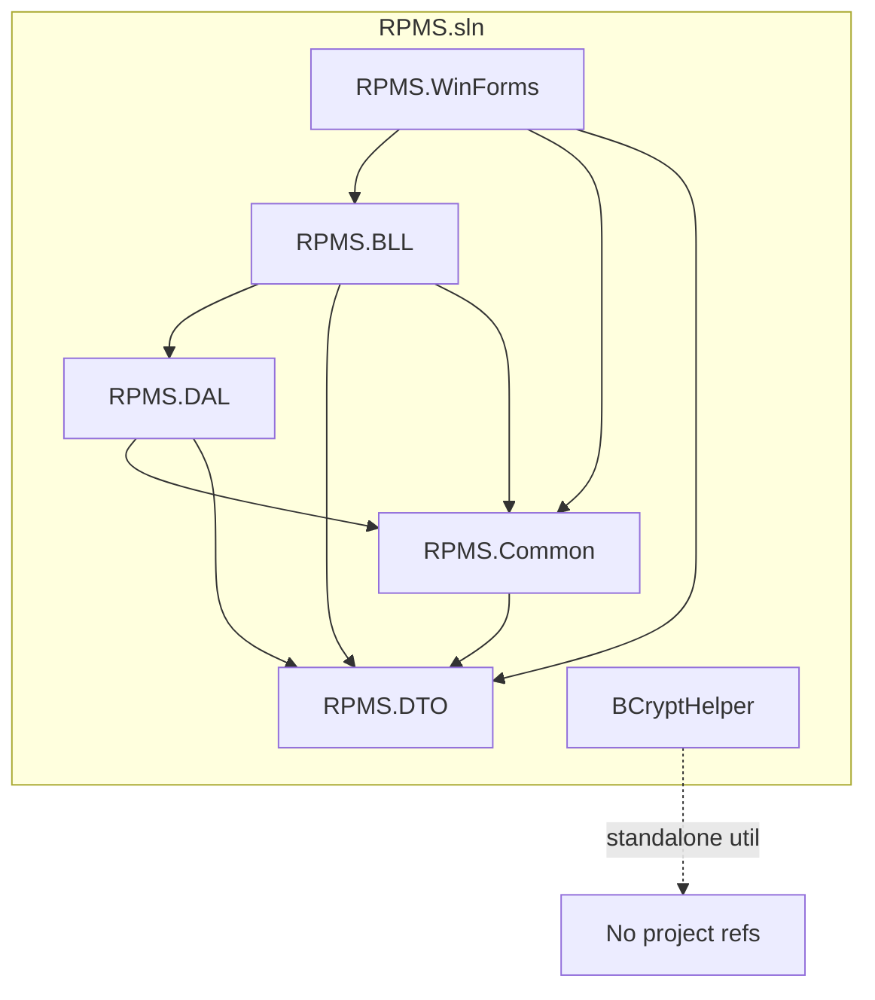
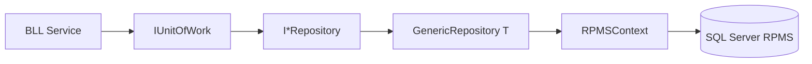
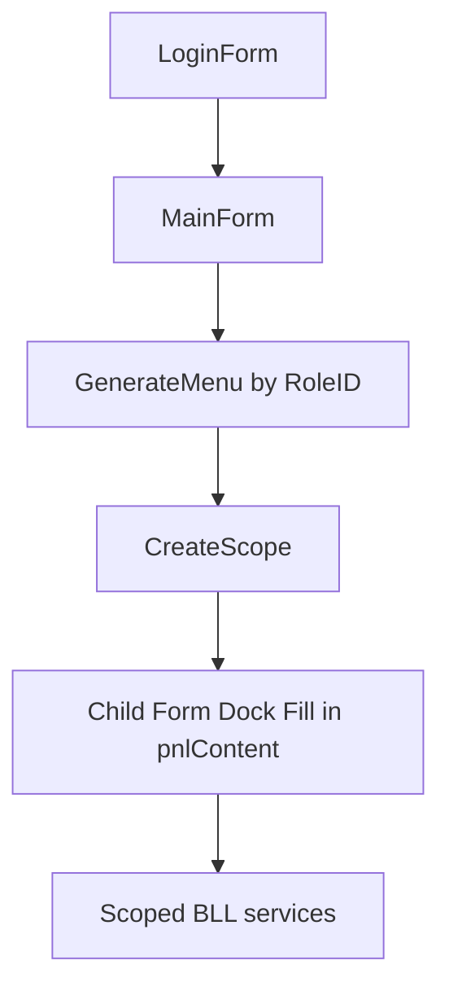

# 01 — Architecture

**Section mapping:** §2 Architecture, §3 Folder tree & deps, §6 Program flow, §15 Dependency graph

---

## 1. Architectural style

**Layered desktop app** with:

- Presentation: WinForms + MS.DI
- Application/Business: BLL services (scoped)
- Persistence: EF Core repositories + Unit of Work
- Shared contracts: DTO + Common constants/session

No CQRS, no MediatR, no HTTP host. Cross-cutting: AutoMapper profiles, BCrypt passwords, static `UserSession`, activity logging in selected flows.

---

## 2. Folder tree (source-focused)

```
RPMS/
├── RPMS.sln
├── RPMS.Common/
│   ├── Constants/          AppColors, AppLayout, AppTypography, NotificationActions
│   └── Globals/            UserSession
├── RPMS.DTO/               Auth, User, Role, House, Room, Post, Contract, Invoice, …
├── RPMS.DAL/
│   ├── Data/RPMSContext.cs
│   ├── Entities/
│   ├── Configurations/     IEntityTypeConfiguration<>
│   ├── Repositories/Interfaces|Implements
│   ├── UnitOfWork/
│   ├── DatabaseSchemaUpdater.cs
│   └── DalDependencyInjection.cs
├── RPMS.BLL/
│   ├── Interfaces/ | Services/
│   ├── Helpers/            Password, RentProration, ContractPricing
│   ├── Mappings/MappingProfile.cs
│   ├── Exceptions/
│   ├── DataSeeder.cs
│   └── BllDependencyInjection.cs
├── RPMS.WinForms/
│   ├── Program.cs
│   ├── Forms/ Auth | Admin | Landlord | Tenant | Manager | Shared | Layout | Dashboard
│   ├── Controls/
│   └── UI/                 UIHelper, print/export helpers, AppDialog
├── Database/
│   ├── RPMS_Full.sql
│   ├── Fix_Unicode_Sample.sql / FixUnicode/
│   └── README_ENCODING.md
├── BCryptHelper/
├── tools/                  RpmsSmoke, RpmsTestExec, RpmsE2EFlows, scripts
└── Docs/                   tests + SystemDocumentation/
```

---

## 3. Project dependency graph



**NuGet vs project refs:** BLL references BCrypt and AutoMapper; DAL references EF Core; WinForms only references DI + BLL/Common/DTO (DAL is pulled transitively via BLL).

---

## 4. Composition root & lifetimes

| Registration | Lifetime | Location |
|--------------|----------|----------|
| `RPMSContext` | Scoped (via AddDbContext) | `DalDependencyInjection` |
| All repositories + `IUnitOfWork` | Scoped | DAL DI |
| All BLL services | Scoped | `BllDependencyInjection` |
| AutoMapper | From AddAutoMapper | BLL DI |
| `IBackupService` | Singleton (WinForms) | `Program.ConfigureServices` |
| Forms | Transient | `Program.ConfigureServices` |

**Important UI pattern:** `MainForm.LoadChildForm` creates a **new `IServiceScope` per child screen** so DbContext is not shared across concurrent async navigations (comment in `MainForm.cs`).

Root `Program.ServiceProvider` is also used for Login/Register/Main and ad-hoc resolves (e.g. Register from Login).

---

## 5. Data access architecture



- `IGenericRepository<T>`: GetAll/GetById/Find/FirstOrDefault/Add/Update/Remove/Exists/Count + optional `includeProperties` string (EF Include split by comma).
- Entity-specific repository interfaces add **no extra methods** (verified inventory).
- Transactions: `BeginTransactionAsync` / `Commit` / `Rollback` on UoW (used e.g. contract create, amenity assign).

---

## 6. Schema evolution strategy

1. **Baseline:** run `Database/RPMS_Full.sql` (DROP/CREATE database + tables + indexes + sample data). Note: physical MDF path in script is machine-specific (`C:\Users\ACER\RPMS\...`).
2. **Runtime patches:** `DatabaseSchemaUpdater.EnsureUpdatedAsync`:
   - `EnsureCreatedAsync()` (creates from EF model if empty)
   - ALTER Reviews (LandlordReply columns)
   - CREATE ChatConversations / ChatMessages if missing
   - Contracts: nullable TenantID; Status CHECK includes Draft/PendingConfirm; pending-edit & cancel columns
   - Notifications: ActionType, RelatedID, ActionStatus
   - Seed missing Amenities catalog rows
3. **DataSeeder:** password hashing, Unicode name fixes, amenity sync, sample timeline sync, empty-DB role/user fallback.

SQL script Notifications table (original) **lacks** action columns — they are added only by schema updater. Chat tables are **not** in `RPMS_Full.sql` CREATE list (grep showed tables through ActivityLogs only).

---

## 7. UI architecture



- Sidebar: `SidebarButton` with `Tag` string keys (`"Dashboard"`, `"LandlordContract"`, …).
- Unknown/missing form → placeholder label `"Đang xây dựng: {tag}"` (or DI exception for Backup if type missing).
- Theme: `AppColors`, `AppTypography`, `AppLayout` + `UIHelper`.

---

## 8. Security architecture (as implemented)

| Concern | Implementation |
|---------|----------------|
| Password storage | BCrypt via `PasswordHelper` / seeder |
| Session | In-memory static `UserSession.CurrentUser` (`LoginResponseDto`) |
| Token | `AuthService` returns `Token = "JWT_TOKEN_MOCK"` — not validated later |
| Authorization | RoleID checks in UI menus + some service methods (e.g. landlord owns house) |
| Connection | Windows Trusted_Connection to local SQLEXPRESS |

---

## 9. Cross-cutting concerns

| Concern | Where |
|---------|--------|
| Mapping | `MappingProfile` (+ manual map in `NotificationService`) |
| Domain errors | `RPMS.BLL/Exceptions/*` |
| Activity log | `IActivityLogService` (login, logout, contract actions, …) |
| Notifications | `INotificationService` + actionable types in `NotificationActions` |
| Printing/export | `ContractPrintHelper`, `InvoicePrintHelper`, `MaintenancePrintHelper`, `ExportHelper` |

---

## 10. Tools architecture (outside solution build)

Tools reference app assemblies to smoke-test DI, run Excel test cases, or E2E flows. They are **not** required to run the product UI.

---

## Coverage

Fully based on `.sln`, all `.csproj` PackageReferences, DI files, `Program.cs`, `MainForm`, DAL/BLL structure. Private methods inside largest forms/services are summarized in modules/methods docs rather than listed here.
