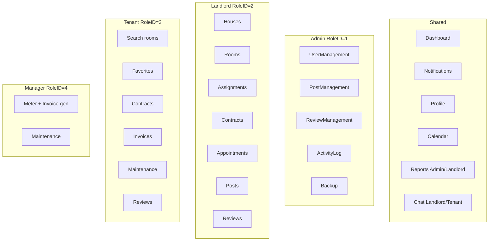

# 03 — Modules

**Section mapping:** §7 Modules, §12 Events (UI/domain)

Modules are organized by **role UI surfaces** and **domain services**. Citations point to real files.

---

## 1. Module map by role

Menu generation: `RPMS.WinForms/Forms/Layout/MainForm.cs` → `GenerateMenu` / `LoadChildForm`.

---

## 2. Auth module

| Piece | Path |
|-------|------|
| Login UI | `Forms/Auth/LoginForm.cs` |
| Register UI | `Forms/Auth/RegisterForm.cs` |
| Auth service | `RPMS.BLL/Services/AuthService.cs` |
| Session | `RPMS.Common/Globals/UserSession.cs` |

**Events:** `btnLogin_Click` → `IAuthService.LoginAsync` → `UserSession.Login`. Register link opens `RegisterForm` → `IUserService.CreateUserAsync` (not on AuthService). Logout: `btnLogout_Click` → ActivityLog `Logout` → `DialogResult.Retry`.

---

## 3. User & role administration

| Piece | Path |
|-------|------|
| User grid/modal | `Forms/Admin/UserManagementForm.cs`, `UserModalForm.cs` |
| Services | `UserService`, `RoleService` |

Soft-delete = `Status = Inactive`. Toggle Active/Inactive.

---

## 4. Property module (House / Room / Amenity)

| Piece | Path |
|-------|------|
| Landlord house UI | `LandlordHouseForm`, `LandlordHouseModalForm` |
| Landlord room UI | `LandlordRoomForm`, `LandlordRoomModalForm` |
| Services | `HouseService`, `RoomService`, `AmenityService` |

Rooms: images (`UploadRoomImagesAsync`), amenities (`AssignAmenitiesAsync`). Status driven by contracts (`Occupied`/`Available`) and maintenance.

---

## 5. Listing / Post module

| Piece | Path |
|-------|------|
| Landlord create | `LandlordPostForm.cs` |
| Admin moderate | `PostManagementForm.cs`, `PostDetailModalForm.cs` |
| Tenant browse | `TenantHomeForm.cs`, `RoomDetailForm.cs` |
| Service | `PostService`, search via `TenantService.SearchRoomsAsync` |

Flow: Create → `Pending` → Admin Approve/Reject → Approved posts searchable if not expired.

---

## 6. Contract module (core)

| Piece | Path |
|-------|------|
| Landlord | `LandlordContractForm.cs` |
| Tenant | `TenantContractForm.cs` |
| Notification actions UI | `Forms/Shared/ContractNotificationUi.cs` (`NotificationActionForm`, `ContractDetailViewForm`) |
| Service | `ContractService.cs` / `IContractService.cs` |

States: `Draft` → `PendingConfirm` → `Active` → `Terminated` (also `Expired` in DB CHECK).

Sub-flows:

- Bulk draft per house
- Assign tenant → notify
- Accept/reject offer
- Edit Active → pending fields + `ActionType=ContractEdit`
- Cancel request → `ActionType=ContractCancel`
- Extend / Terminate

---

## 7. Invoice & meter module

| Piece | Path |
|-------|------|
| Manager meter UI | `ManagerMeterForm.cs` |
| Tenant invoices | `TenantInvoiceForm.cs`, `InvoiceDetailForm.cs` |
| Service | `InvoiceService` + `ContractPricingHelper` / `RentProrationHelper` |

Generate for **finished** month only; creates MeterReading + Invoice `Unpaid`; payment → `Paid` + Payment `Completed`.

---

## 8. Appointment module

| Piece | Path |
|-------|------|
| Tenant book | `TenantAppointmentModalForm.cs`, from `RoomDetailForm` |
| Landlord manage | `LandlordAppointmentForm.cs` |
| Services | `TenantInteractionService.BookAppointmentAsync`, `LandlordService.UpdateAppointmentStatusAsync` |

Statuses used in BLL: Pending, Accepted, Rejected, Cancelled, Completed.

---

## 9. Favorites module

| Piece | Path |
|-------|------|
| UI | `TenantFavoriteForm.cs`, toggle on `RoomCardControl` / detail |
| Service | `TenantInteractionService` Toggle/Get/Remove |

---

## 10. Assignment (Manager) module

| Piece | Path |
|-------|------|
| UI | `LandlordAssignmentForm.cs` |
| Service | `AssignmentService` |

Rule (BLL): house must have an **Active** contract before assigning manager; manager RoleID 4 / role name Manager; notifies manager.

---

## 11. Maintenance module

| Piece | Path |
|-------|------|
| Tenant | `TenantMaintenanceForm.cs` |
| Manager | `ManagerMaintenanceForm.cs`, `MaintenanceDetailForm.cs` |
| Service | `MaintenanceService` |

Statuses: Pending → Processing (assigns manager) → Completed.

---

## 12. Review module

| Piece | Path |
|-------|------|
| Tenant / Landlord / Admin | `TenantReviewForm`, `LandlordReviewForm`, `ReviewManagementForm` |
| Service | `ReviewService` |

Create only when contract `Terminated` or `Expired`; one review per contract; landlord reply.

---

## 13. Notification module

| Piece | Path |
|-------|------|
| UI | `NotificationCenterForm.cs` + `ContractNotificationUi.cs` |
| Service | `NotificationService` |
| Constants | `NotificationActions.cs` |

Actionable: `ContractEdit` / `ContractCancel` with `ActionStatus` Pending/Completed/Declined. Many other notifies are informational only.

**Domain “events”** are not a bus — they are DB notification rows + ActivityLog entries created inside services.

---

## 14. Chat module

| Piece | Path |
|-------|------|
| UI | `ChatForm.cs` (Landlord & Tenant menus) |
| Service | `ChatService` |
| Schema | ChatConversations / ChatMessages via updater |

---

## 15. Calendar / Dashboard / Reports

| Piece | Path |
|-------|------|
| Calendar | `CalendarForm.cs` + `CalendarService` (events by role) |
| Dashboard | `DashboardForm.cs` + `StatisticService` / Tenant dashboard via `TenantService` |
| Reports | `ReportForm.cs` + `ReportService` (Admin + Landlord) |

---

## 16. Activity log & Backup

| Piece | Path |
|-------|------|
| Activity UI | `ActivityLogForm.cs` + `ActivityLogService` |
| Backup menu | MainForm tag `"Backup"` → `Forms.Admin.BackupForm` |

**Gap:** `BackupForm.cs` and `BackupService.cs` are **referenced but missing** on disk → Admin Backup menu will fail DI resolve.

---

## 17. UI building blocks

`RPMS.WinForms/Controls/*`: ModernButton/TextBox/DataGridView, SidebarButton, SummaryCard, RoomCardControl, LoadingPanel, EmptyStatePanel, OccupancyChartPanel, StatusTimelineControl, ToastNotifier.

`RPMS.WinForms/UI/*`: UIHelper, AppDialog, ImagePathHelper, ExportHelper, print helpers.

---

## 18. Cross-module event matrix (selected)

| Trigger | Notification / log |
|---------|-------------------|
| Login | Activity `Login` |
| Logout | Activity `Logout` |
| Post approve/reject | Notify house Owner |
| Assign tenant / accept / reject rental | Notify counterpart + Activity |
| Contract edit/cancel pending | Actionable notification |
| Invoice generated / paid | Notify tenant / landlord |
| Appointment book / status | Notify landlord / tenant |
| Assignment create | Notify manager |
| Review create / reply | Notify landlord / tenant |
| Chat message | Notify receiver |

---

## Coverage

All menu tags and form registrations from `MainForm`/`Program` covered. Deep click-handlers of largest forms (`LandlordContractForm`) summarized by capability, not every private method — see [05_Method_Documentation.md](05_Method_Documentation.md).
