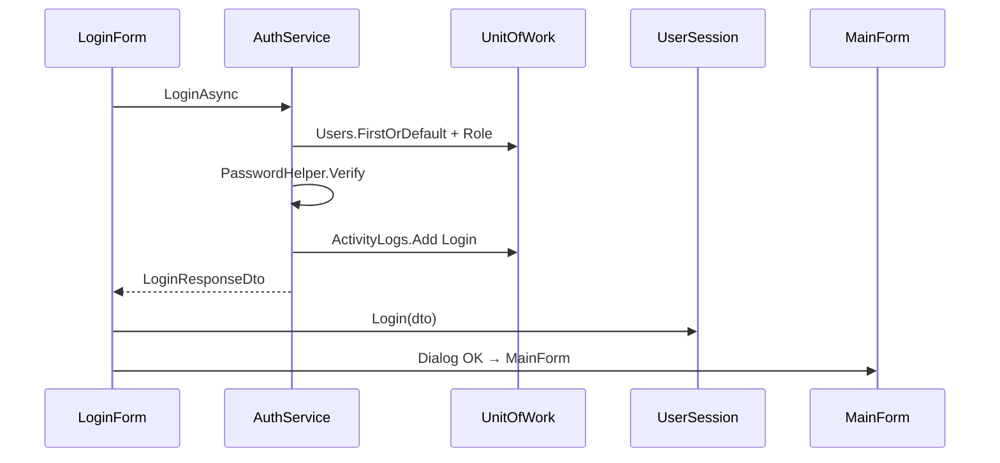
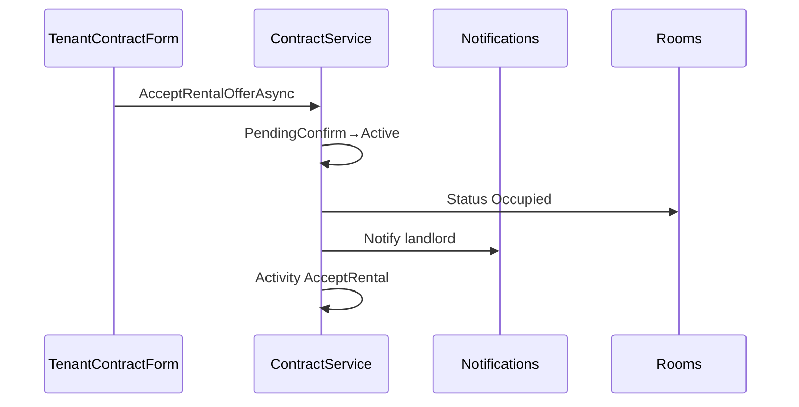
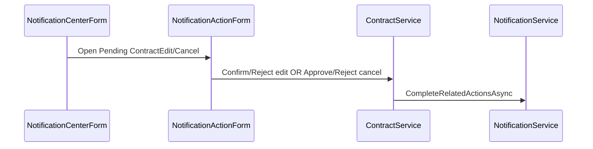

# 05 — Method Documentation

**Section mapping:** §9 Methods

Documents **public/internal business methods** in BLL services, DAL repository/UoW surfaces, and key WinForms handlers. Trivial getters/setters and pure Designer boilerplate are listed briefly.

---

## 1. DAL — `IGenericRepository<T>`

File: `RPMS.DAL/Repositories/Interfaces/IGenericRepository.cs`  
Impl: `Repositories/Implements/GenericRepository.cs`

| Method | Behavior |
|--------|----------|
| `GetAllAsync(includeProperties="")` | Query all; optional comma-separated Includes |
| `GetByIdAsync(id)` | Find by PK |
| `FindAsync(expression, includeProperties)` | Where + includes |
| `FirstOrDefaultAsync(...)` | First or default |
| `AddAsync` / `AddRangeAsync` | Insert |
| `Update` / `Remove` / `RemoveRange` | Track mutations |
| `ExistsAsync` / `CountAsync` | Predicates |

Entity-specific `I*Repository` interfaces: **no additional methods**.

### `IUnitOfWork`

File: `UnitOfWork/Interfaces/IUnitOfWork.cs`

- Properties: all entity repositories (Roles…ChatMessages)
- `SaveChangesAsync`, `BeginTransactionAsync`, `CommitTransactionAsync`, `RollbackTransactionAsync`, `Dispose`/`DisposeAsync`

Impl: `UnitOfWork/Implements/UnitOfWork.cs` — lazy repo wiring.

### `DatabaseSchemaUpdater.EnsureUpdatedAsync`

Public static entry — see [02_Database.md](02_Database.md). Private: `EnsureContractColumnAsync`, `ExecAsync`.

---

## 2. BLL Services

Unless noted, ctor depends on `IUnitOfWork` (+ `IMapper` where mapping used).

### AuthService — `IAuthService`

| Method | Params → Return | Behavior |
|--------|-----------------|----------|
| `LoginAsync` | `LoginRequestDto` → `LoginResponseDto` | Load user+role; BCrypt verify; require Active; Activity `Login`; Token=`JWT_TOKEN_MOCK` |
| `ChangePasswordAsync` | userId, `ChangePasswordDto` → bool | Non-empty, ≥6 chars, confirm match; verify old; hash new |
| `ResetPasswordAsync` | email, newPassword → bool | Find by email; hash (no strength check) |

### UserService — `IUserService`

| Method | Behavior |
|--------|----------|
| `GetAllUsersAsync` / `GetUsersByRoleAsync` / `GetUserByIdAsync` | Query+map; not found → exception |
| `CreateUserAsync` | Unique username/email; hash password; Status Active |
| `UpdateUserAsync` | Profile/role/status; email uniqueness |
| `DeleteUserAsync` | Soft Inactive |
| `ToggleUserStatusAsync` | Active ↔ Inactive |

### RoleService
`GetAllRolesAsync()` only.

### HouseService
CRUD + `GetHousesByOwnerAsync`. Create → Status Active. Delete fails if rooms exist.

### RoomService
| Method | Behavior |
|--------|----------|
| `GetRoomsByHouseAsync` / `GetRoomDetailAsync` | |
| `CreateRoomAsync` | Unique number; Available |
| `UpdateRoomAsync` / `DeleteRoomAsync` | Delete blocked if Occupied |
| `UpdateRoomStatusAsync` | Sets status string as-is |
| `UploadRoomImagesAsync` | Replace images |
| `AssignAmenitiesAsync` | Transaction replace RoomAmenities |

### AmenityService
`GetAllAmenitiesAsync`, `CreateAmenityAsync` (unique name), `DeleteAmenityAsync`.

### PostService
| Method | Behavior |
|--------|----------|
| `GetAllActivePostsAsync` | Approved + not expired; Featured then date |
| `GetPendingPostsAsync` | Pending |
| `GetPostByIdAsync` / `IncrementViewCountAsync` | |
| `CreatePostAsync` | Room Available; Status Pending; expiry months; images |
| `ApprovePostAsync` / `RejectPostAsync` | Notify owner |

### ContractService — `IContractService` (core)

| Method | Behavior |
|--------|----------|
| `GetAll*` / `GetContractsByTenant/Landlord/Manager` | Filtered lists |
| `GetContractByIdAsync` | Detail DTO |
| `CreateContractAsync` | Tx; no Occupied room / no open HĐ; with tenant→PendingConfirm+notify else Draft; code `HDyyyyMMddHHmmss{RoomID}` |
| `CreateDraftContractsForHouseAsync` | Bulk Draft for eligible rooms |
| `AssignTenantAsync` | Draft→PendingConfirm; Tenant role Active; notify |
| `AcceptRentalOfferAsync` | PendingConfirm→Active; MoveIn=Today; Room Occupied; notify landlord |
| `RejectRentalOfferAsync` | Clear tenant→Draft; notify |
| `UpdateContractAsync` | Draft apply live; Active→Pending* + notify ContractEdit |
| `ConfirmContractEditAsync` | Apply pending; Previous* + PriceEffectiveDate; complete notifs |
| `RejectContractEditAsync` / `CancelPendingContractEditAsync` | Clear pending; Declined |
| `RequestCancelAsync` | Active; CancelRequest Pending; notify ContractCancel |
| `ApproveCancelRequestAsync` | → Terminate |
| `RejectCancelRequestAsync` | Clear cancel; Declined |
| `TerminateContractAsync` (overloads) | Terminated; free room if was Active/Occupied; clear pending; notify |
| `ExtendContractAsync` | Active; new End > current; notify tenant |

### InvoiceService
| Method | Behavior |
|--------|----------|
| `GetInvoicesByContractAsync` | May heal Unpaid→Paid if Completed payment exists |
| `GetInvoiceByIdAsync` | Detail + proration note via RentProrationHelper |
| `GetLatestReadingAsync` | Latest meter |
| `GenerateMonthlyInvoiceAsync` | Active+tenant; month finished; new≥old; ContractPricingHelper; Unpaid; notify tenant |
| `ProcessPaymentAsync` | Amount≥Total; Payment Completed; Paid; notify landlord |

### NotificationService
| Method | Behavior |
|--------|----------|
| `GetByUserAsync` | Optional isRead + keyword |
| `GetUnreadCountAsync` / `GetByIdAsync` | |
| `MarkAsReadAsync` / `MarkAllAsReadAsync` / `DeleteAsync` / `CreateAsync` | |
| `CompleteRelatedActionsAsync` | Matching Pending actions → newStatus + IsRead |
| `BuildEntity` (static) | Sets ActionType/RelatedID/ActionStatus |

### AssignmentService
`GetAllAsync`, `GetByLandlordAsync`, `GetByManagerAsync`, `CreateAsync` (requires Active contract on house), `DeactivateAsync`.

### TenantInteractionService
`BookAppointmentAsync`, `ToggleFavoriteAsync`, `GetFavoritesAsync`, `RemoveFavoriteAsync`.

### LandlordService
`GetAppointmentsAsync`, `GetAppointmentTenantsAsync`, `UpdateAppointmentStatusAsync`, `CreateNotificationForTenantsAsync`.

### TenantService
`GetTenantDashboardAsync`, `SearchRoomsAsync` (filters/sort), `SendContractRequestAsync` (informational notify only).

### MaintenanceService
Get by house/tenant/manager; `CreateRequestAsync` (Pending); `UpdateRequestStatusAsync` (Processing assigns manager; Completed sets date); `GetRequestByIdAsync`; `DeleteRequestAsync`; `SendMaintenanceNotificationAsync`.

### ReviewService
`CreateReviewAsync` (Terminated/Expired, rating 1–5, one per contract); `ReplyAsync`; lists; `GetAverageRatingForHouseAsync`.

### ChatService
`GetConversationsAsync`, `GetOrCreateConversationAsync`, `GetMessagesAsync`, `SendMessageAsync`, `MarkConversationReadAsync`, `GetUnreadCountAsync`.

### CalendarService
`GetEventsAsync(userId, roleId, from, to)` — role-scoped Appointment/Contract/Invoice/Maintenance events.

### StatisticService
`GetAdminDashboardStatsAsync`, `GetLandlordDashboardStatsAsync`, `GetManagerDashboardStatsAsync`.

### ReportService
`GetAdminReportAsync`, `GetLandlordReportAsync`.

### ActivityLogService
`LogAsync`, `GetRecentAsync`, `GetByUserAsync`.

### IBackupService (interface only)
`BackupDatabaseAsync`, `RestoreDatabaseAsync`, `ConnectionString` — **no implementation file**.

### Helpers

| Type | Methods |
|------|---------|
| `PasswordHelper` | `HashPassword`, `VerifyPassword` |
| `RentProrationHelper` | `Calculate(...)` → `RentProrationResult` |
| `ContractPricingHelper` | `WeightedUnitCost`, `CalculateRent` |

### DataSeeder
`SeedAsync(RPMSContext)` (+ private EnsureAmenities / SyncSampleTimeline / etc.).

---

## 3. Key WinForms event handlers / flows

### Auth / Shell
| Handler | File | Calls |
|---------|------|-------|
| `btnLogin_Click` | LoginForm | `IAuthService.LoginAsync` → UserSession |
| `lblRegisterLink_Click` | LoginForm | RegisterForm dialog |
| `btnRegister_Click` | RegisterForm | `IUserService.CreateUserAsync` |
| `MenuButton_Click` / `LoadChildForm` | MainForm | Scope + resolve child |
| `btnLogout_Click` | MainForm | Log Logout; Retry |

### Contracts (high level)
| UI | Typical actions |
|----|-----------------|
| `LandlordContractForm` | Create/bulk draft/assign/update/extend/terminate/cancel request; open detail |
| `TenantContractForm` | Accept/reject offer; confirm/reject edit; cancel request |
| `NotificationActionForm` | Approve/decline ContractEdit/ContractCancel via `IContractService` |

### Posts / Rooms
| UI | Actions |
|----|---------|
| `PostManagementForm` | Approve/Reject pending |
| `LandlordPostForm` | Create post + images |
| `TenantHomeForm` / `RoomDetailForm` | Search, book, favorite, view count |

### Invoices
| `ManagerMeterForm` | `GenerateMonthlyInvoiceAsync` |
| `TenantInvoiceForm` / `InvoiceDetailForm` | List/detail; `ProcessPaymentAsync`; export/print |

### Other
| Form | Key actions |
|------|-------------|
| `LandlordAppointmentForm` | Update appointment status |
| `LandlordAssignmentForm` | Create/deactivate assignment |
| `TenantMaintenanceForm` | Create request + image |
| `ManagerMaintenanceForm` | Status update / detail |
| `NotificationCenterForm` | Mark read; open action form |
| `ChatForm` | Send/read messages |
| `ProfileForm` | Update user + ChangePassword |
| `ReportForm` | Load report; export CSV/HTML |
| `DashboardForm` | Load stats by role |

Designer-only handlers (Load paint/resize/show-password): exist on Login/Register/UserManagement/etc. — **one-line note:** UI chrome only.

---

## 4. Call graph — Login

## 5. Call graph — Accept rental

## 6. Call graph — Actionable notification

---

## Coverage

- **Full signatures:** all BLL interfaces (grep-verified).
- **Behavior:** from service exploration pass; ContractService / InvoiceService / NotificationService emphasized.
- **WinForms:** main business handlers; not every `private void xxx_Click` in Designer files.
- **Chưa đọc hết:** private method-by-method of `LandlordContractForm.cs`, `ContractService.cs` (~large), `RpmsTestExec`/`RpmsE2EFlows` Program.cs internals.
