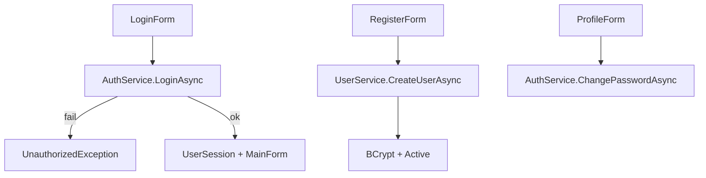
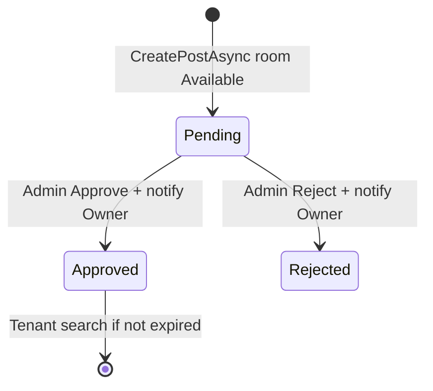
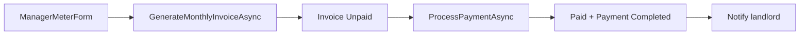

# 06 — Business Logic

**Section mapping:** §13 Algorithms, §14 Business, §16 Call graphs

Sources: `RPMS.BLL/Services/*`, Helpers, `DataSeeder`, `NotificationActions`, WinForms orchestration.

---

## 1. Status dictionaries (exact strings from code)

| Domain | Values |
|--------|--------|
| User | `Active`, `Inactive` |
| Role names | `Admin`, `Landlord`, `Tenant`, `Manager` |
| House | `Active`, `Inactive` |
| Room | `Available`, `Occupied`, `Maintenance`, (+ BLL may use `Inactive`) |
| Post | `Pending`, `Approved`, `Rejected` |
| Contract | `Draft`, `PendingConfirm`, `Active`, `Expired`, `Terminated` |
| PendingEditStatus / CancelRequestStatus | `Pending` (cleared null when done) |
| CancelRequestedBy | `Landlord`, `Tenant` |
| Invoice | `Unpaid`, `Paid` (+ SQL `Overdue`) |
| Payment | `Completed` (+ Pending/Failed in schema) |
| Appointment | `Pending`, `Accepted`, `Rejected`, `Cancelled`, `Completed` |
| Assignment | `Active`, `Inactive` |
| Maintenance | `Pending`, `Processing`, `Completed` |
| Notification ActionType | `ContractEdit`, `ContractCancel` |
| Notification ActionStatus | `Pending`, `Completed`, `Declined` |

Role IDs in UI/services: **1 Admin, 2 Landlord, 3 Tenant, 4 Manager**.

---

## 2. Algorithms

### 2.1 Password hashing
`PasswordHelper` → BCrypt.Net-Next. Seeder upgrades plaintext passwords that do not start with `$2a$`/`$2b$`/`$2y$`.

### 2.2 Rent proration — `RentProrationHelper`
Formula: `MonthlyRent / daysInMonth × occupiedDays` (round AwayFromZero).  
Stay window: `(moveIn ?? start)` … `(moveOut ?? end)` ∩ billing month.  
Used when presenting invoice detail notes.

### 2.3 Mid-month price change — `ContractPricingHelper`
When tenant confirms a contract edit, Previous* prices + `PriceEffectiveDate=Now` are stored. Invoice generation:

- **Utilities:** weighted average unit price by days before/after effective date × usage.
- **Rent:** occupied days split at effective date between previous and current monthly rent.

### 2.4 Invoice generation rules (`InvoiceService.GenerateMonthlyInvoiceAsync`)
- Contract must be `Active` with tenant.
- Billing month must be **finished** (not current month).
- No duplicate MeterReading for that month.
- Old meters from previous reading (or 0).
- New ≥ Old validation.
- Creates MeterReading + Invoice `Unpaid`, DueDate = month end, notifies tenant.

### 2.5 Contract code
`HD` + `yyyyMMddHHmmss` + `RoomID` (from ContractService create path).

---

## 3. Business flows

### 3.1 Login / Register / Change password

Register is **not** on `IAuthService`.

### 3.2 Posts

### 3.3 Houses / Rooms
- Create house → Active; delete only if no rooms.
- Create room → Available; cannot delete Occupied.
- Accept rental → Occupied; Terminate Active → Available.

### 3.4 Contracts (full lifecycle)

```mermaid
stateDiagram-v2
  [*] --> Draft: Create no tenant / Bulk / Reject offer
  Draft --> PendingConfirm: AssignTenant / Create with tenant
  PendingConfirm --> Active: AcceptRental room Occupied
  PendingConfirm --> Draft: RejectRental
  PendingConfirm --> Terminated: Terminate
  Draft --> Terminated: Terminate
  Active --> Terminated: Terminate / ApproveCancel
  Active --> Active: Extend; cancel rejected
```

**Edit while Active:** landlord `UpdateContractAsync` writes Pending* fields, `PendingEditStatus=Pending`, notification `ActionType=ContractEdit`, `RelatedID=ContractID`. Tenant Confirm applies prices + Previous* + PriceEffectiveDate; Reject/Cancel clears.

**Cancel while Active:** `RequestCancelAsync` sets CancelRequest*; notifies other party `ContractCancel`. Approve → Terminate; Reject → clear request.

**Note:** Field names are `RelatedID` / `ActionType` / `ActionStatus` — there is **no** `ActionPayload` or `RelatedEntityId` property.

### 3.5 Invoices & payment

### 3.6 Appointments
Tenant books future date → Pending + notify landlord → landlord sets Accepted/Rejected/Cancelled/Completed → notify tenant.

### 3.7 Favorites
Toggle unique (UserID, RoomID); list on TenantFavoriteForm.

### 3.8 Manager assignment
Landlord assigns Active manager to house **only if house has Active rental contract**; Assignment Active/Inactive; notify manager. UI: `LandlordAssignmentForm`.

### 3.9 Maintenance
Tenant creates Pending → Manager Processing (AssignedManager set) → Completed (+ CompletedDate). Optional notify tenant.

### 3.10 Reviews
Allowed when contract Terminated or Expired; one per contract; landlord reply with timestamps (schema-updated columns).

### 3.11 Notifications UX
`NotificationCenterForm` lists items; if `CanAct` (Pending actionable), opens `NotificationActionForm` which calls ContractService confirm/reject/approve/reject cancel.

### 3.12 Chat / Calendar / Reports / Stats
- Chat: landlord↔tenant conversation unique pair; messages; unread; notify on send.
- Calendar: role-filtered events (Appointment, Contract end, Invoice, Maintenance).
- Reports/Stats: aggregations over houses/rooms/invoices/contracts/users.

### 3.13 Tenant `SendContractRequestAsync`
Free-text notify to landlord — **not** the same as ContractEdit/Cancel action workflow.

---

## 4. DataSeeder business data

See [02_Database.md](02_Database.md) §9. Demo accounts after seed:

| Username | Password | Role |
|----------|----------|------|
| admin | admin123 | Admin |
| namlandlord | 123456 | Landlord |
| tenant | 123456 | Tenant |
| manager | 123456 | Manager |

Legacy usernames `landlord1`/`tenant1`/`manager1` also hashed if present.

---

## 5. Mapping notes

`MappingProfile` enriches ContractDto (`CancelRequestLabel` from CancelRequestedBy when Pending), Post images fallback, Invoice detail meter fields. Notifications mapped **manually** in NotificationService (no AutoMapper map).

---

## 6. Gaps affecting business rules

1. `Expired` status checked for reviews but never set by ContractService (only Terminated).
2. Appointment `Cancelled` / Room `Inactive` may conflict with older SQL CHECKs until schema aligned.
3. JWT mock — no token-based API security.
4. Backup service/form missing — Admin Backup broken at resolve time.
5. Maintenance status updates not closed-set validated in service.

---

## Coverage

Flows above traced from BLL + MainForm + ContractNotificationUi. Full private branching inside `ContractService` / `LandlordContractForm` marked **summarized** where not every edge case was re-read line-by-line in this pass.
