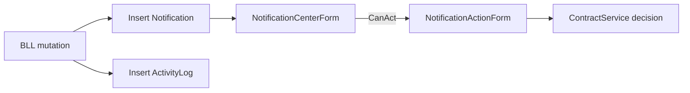

# 08 — Design

**Section mapping:** §12 Events (design of), §13 Algorithms (design), §17 Design patterns, Dependencies extras

---

## 1. Design patterns observed in code

| Pattern | Where |
|---------|--------|
| **Layered architecture** | WinForms → BLL → DAL |
| **Dependency Injection** | MS.DI composition root in `Program.ConfigureServices` |
| **Repository** | `IGenericRepository<T>` + marker repos |
| **Unit of Work** | `IUnitOfWork` wrapping shared `RPMSContext` |
| **DTO / Anti-corruption** | `RPMS.DTO` between UI and entities |
| **Profile mapping** | AutoMapper `MappingProfile` |
| **Service layer** | One service class per domain area |
| **Static session** | `UserSession` (simple singleton-like state) |
| **Strategy-ish UI** | Role-based menu generation (`switch roleId`) |
| **Schema migrator (ad-hoc)** | Raw SQL patches in `DatabaseSchemaUpdater` |
| **Seeder** | `DataSeeder` on startup |

Not used: Mediator, Domain Events bus, CQRS, Factory Method as first-class pattern, Repository Query Specifications beyond Expression predicates.

---

## 2. UI design system

Sources: `RPMS.Common/Constants/AppColors.cs`, `AppTypography.cs`, `AppLayout.cs`, `RPMS.WinForms/UI/UIHelper.cs`, custom Controls.

| Aspect | Approach |
|--------|----------|
| Colors | Shared `AppColors` static palette |
| Fonts | Segoe UI clones via `AppTypography` |
| Layout spacing | `AppLayout` constants |
| Controls | ModernButton (rounded), ModernTextBox (placeholder), ModernDataGridView, SidebarButton, SummaryCard, RoomCardControl |
| Dialogs | `AppDialog` static helpers |
| Feedback | `ToastNotifier`, LoadingPanel, EmptyStatePanel |
| Shell | `MainForm` sidebar + content host; child forms Dock Fill, TopLevel false |

Many Landlord/Tenant/Manager screens build UI in code (no Designer) for grids/toolbars; Auth/Admin user/post screens use Designer partials.

---

## 3. Event model (UI + domain)

### UI events
Standard WinForms: Click, CellContentClick, Load, SelectedIndexChanged, timers (e.g. Chat polling if present in ChatForm). Navigation is tag-driven sidebar clicks.

### Domain “events”
Implemented as:

1. **Notification rows** inserted inside BLL methods.
2. **ActivityLog** rows for audit-worthy actions.
3. **Actionable notifications** with `ActionType` + `RelatedID` + `ActionStatus` driving `NotificationActionForm`.

There is no `IEventBus` / `OnContractAccepted` C# event aggregator.

---

## 4. Dependency design (NuGet)

See [00_Project_Overview.md](00_Project_Overview.md) and [01_Architecture.md](01_Architecture.md). Notable choices:

- EF Core 8.0.29 aligned SqlServer + Tools.
- AutoMapper 12 (older DI extension package still used).
- BCrypt.Net-Next for passwords.
- WinForms keeps DAL behind BLL reference only (project refs).

---

## 5. Algorithm design (summary)

Documented fully in [06_Business_Logic.md](06_Business_Logic.md):

- Day-based rent proration
- Weighted utility/rent after mid-month price confirmation
- Invoice only for closed months
- Soft delete users via Status

---

## 6. Error handling design

- BLL throws typed exceptions (`UnauthorizedException`, `BadRequestException`, `NotFoundException`).
- WinForms typically catch and show `AppDialog` / inline error labels.
- Startup DB failure → MessageBox then exit.
- Logout logging failures swallowed.

---

## 7. Concurrency / scoping design

Comment in `MainForm.LoadChildForm`: each child screen gets its **own DI scope** to avoid sharing one DbContext across concurrent async navigations. Scope disposed when leaving the screen.

---

## 8. Printing / export design

HTML-oriented helpers (`ContractPrintHelper`, `InvoicePrintHelper`, `MaintenancePrintHelper`) and `ExportHelper` (CSV/HTML/print preview) keep presentation out of BLL.

---

## 9. Security design (as-is)

- Passwords hashed.
- Role gates primarily in UI menu + some service ownership checks.
- No claims principal; RoleID integer comparisons.
- Connection uses Windows auth to local SQL.

---

## Coverage

Patterns inferred only where code exhibits them. Visual Designer pixel layouts not documented.
