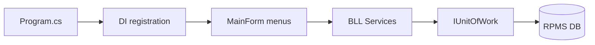

# 10 — Onboarding

**Section mapping:** §10 Variables (runtime), §20 Onboarding

Guide for a new developer to run and navigate RPMS from this repository.

---

## 1. Prerequisites

| Requirement | Notes |
|-------------|--------|
| Windows | WinForms `net8.0-windows` |
| .NET 8 SDK | Matches all project TFMs |
| Visual Studio 2022 (or `dotnet` CLI + Windows) | Solution format VS 17 |
| SQL Server Express | Default instance name `.\SQLEXPRESS` (see `Program.ConnectionString`) |
| Permissions | Create/alter database `RPMS` |

---

## 2. Database setup

1. Edit `Database/RPMS_Full.sql` if needed:
   - MDF/LDF paths currently point to `C:\Users\ACER\RPMS\...`
2. Execute the script in SSMS / `sqlcmd` against your SQL instance (script DROPs existing `RPMS` if present — **destructive**).
3. Alternatively: empty DB + let app `EnsureCreatedAsync` + schema updater create from EF model (sample data may be thinner; seeder has empty-DB user fallback).

Connection string (app):

```text
Server=.\SQLEXPRESS;Database=RPMS;Trusted_Connection=True;TrustServerCertificate=True;MultipleActiveResultSets=True;
```

Change instance in `RPMS.WinForms/Program.cs` if yours differs.

---

## 3. Build & run

```powershell
cd E:\DoAn\RPMS
dotnet build RPMS.sln
dotnet run --project RPMS.WinForms
```

Or set `RPMS.WinForms` as startup project in Visual Studio.

On first run:

1. `DatabaseSchemaUpdater.EnsureUpdatedAsync`
2. `DataSeeder.SeedAsync`
3. Login dialog

If DB init fails, MessageBox explains and app exits.

---

## 4. Demo accounts (after seeder)

| Username | Password | RoleID |
|----------|----------|--------|
| admin | admin123 | 1 Admin |
| namlandlord | 123456 | 2 Landlord |
| tenant | 123456 | 3 Tenant |
| manager | 123456 | 4 Manager |

Optional: run `BCryptHelper` to generate hashes for SQL inserts.

---

## 5. Where to look first (mental model)



| Task | Start here |
|------|------------|
| Change menu by role | `Forms/Layout/MainForm.cs` |
| Contract rules | `BLL/Services/ContractService.cs` |
| Notifications actions | `Common/Constants/NotificationActions.cs`, `Forms/Shared/ContractNotificationUi.cs` |
| Schema patches | `DAL/DatabaseSchemaUpdater.cs` |
| Theme | `Common/Constants/AppColors.cs` |
| Entities | `DAL/Entities/` |

---

## 6. Important runtime variables

| Symbol | Meaning |
|--------|---------|
| `Program.ServiceProvider` | Root DI container |
| `Program.ConnectionString` | SQL connection |
| `UserSession.CurrentUser` | Logged-in `LoginResponseDto` |
| RoleID 1–4 | Admin/Landlord/Tenant/Manager |
| Child form `Tag` strings | Navigation keys in MainForm switch |

---

## 7. Known onboarding pitfalls

1. **Backup menu** — types missing; expect error if opened (see [09_Code_Review.md](09_Code_Review.md)).
2. Wrong SQL instance name → startup MessageBox.
3. Running SQL script without fixing file paths → CREATE DATABASE fails.
4. Unicode mojibake in old DBs — seeder/`FixUnicode` tools help.
5. No `appsettings.json` — do not search for it; edit `Program.cs`.

---

## 8. Optional tools

| Tool | Purpose |
|------|---------|
| `tools/RpmsSmoke` | Resolve services/forms |
| `tools/RpmsE2EFlows` | Automated business flows |
| `tools/RpmsTestExec` | Excel test cases |
| `Database/FixUnicode` | Fix Vietnamese encoding |

These may need their own connection string / path configuration inside their `Program.cs` — **verify before run** (not all lines re-read in this doc pass).

---

## 9. Suggested learning path

1. Read [00_Project_Overview.md](00_Project_Overview.md) + [01_Architecture.md](01_Architecture.md)
2. Run app; login as each role; click every sidebar item
3. Read [06_Business_Logic.md](06_Business_Logic.md) contract + invoice sections
4. Trace one flow in code: Login → Create draft → Assign tenant → Accept → Invoice
5. Skim [04_Class_Documentation.md](04_Class_Documentation.md) / [05_Method_Documentation.md](05_Method_Documentation.md) as reference

---

## 10. Doc index

Return to [README.md](README.md) for the full section 1–20 map.
